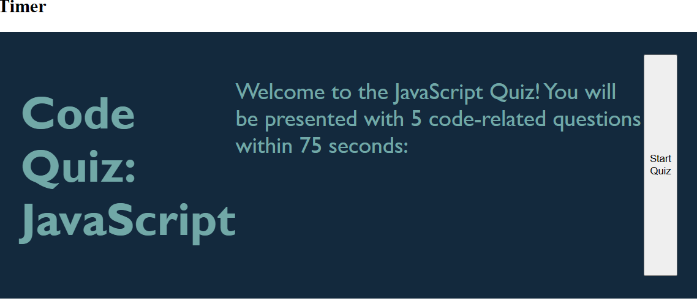
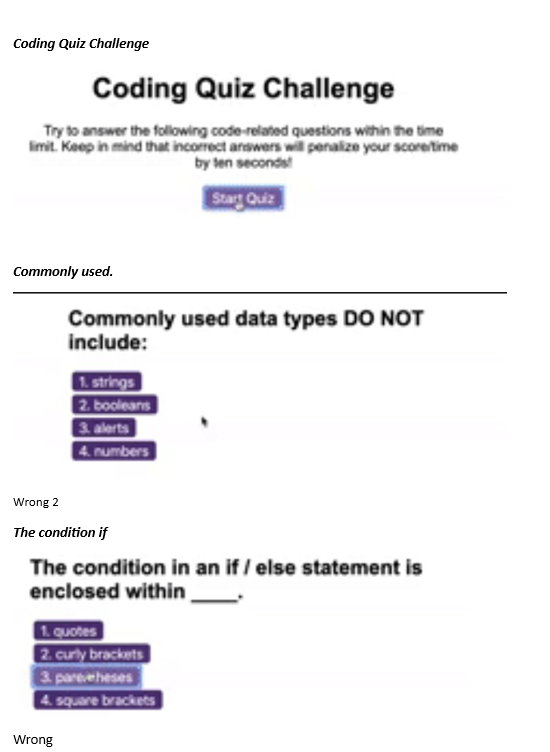
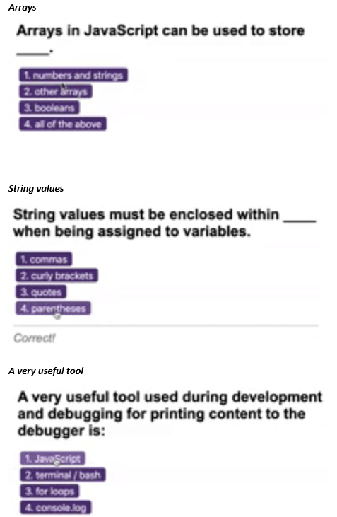
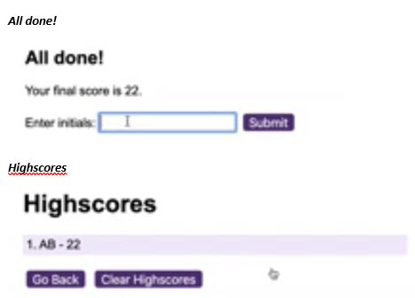

# Java script Code Quiz

link to deploy  https://gonzalogodinez.github.io/Codingquiz

**Description**

As a developer, we prepare ourselves to be ready for a Technical Quiz assesment that could include both multiple-choice questions and interactive coding challenges. 

This is an interactive user interface build timed coding quiz sample with multiple-choice questions. This app will run in the browser and will feature dynamically updated HTML and CSS powered by JavaScript code that you write. 

**Installation**

1.  Install/Update Visual Studio
2.  GUI bash terminal point using CD into project directory.
3.  Git clone this repo.
4.	CD into JavaScript.
5.  Deploy into GITHUB 
6.  Git pull
4.	Open using text editor, for VS Code, command 'code .'

**Usage**

# JavaScript initial coding steps

## aplication screenshoots

The following screen shoots demonstrates the application functionality:

  
  
  

License

MIT License

Copyright (c) 2023 GonzaloGodinez

Permission is hereby granted, free of charge, to any person obtaining a copy of this software and associated documentation files (the "Software"), to deal in the Software without restriction, including without limitation the rights to use, copy, modify, merge, publish, distribute, sublicense, and/or sell copies of the Software, and to permit persons to whom the Software is furnished to do so, subject to the following conditions:
The above copyright notice and this permission notice shall be included in all copies or substantial portions of the Software.
THE SOFTWARE IS PROVIDED "AS IS", WITHOUT WARRANTY OF ANY KIND, EXPRESS OR IMPLIED, INCLUDING BUT NOT LIMITED TO THE WARRANTIES OF MERCHANTABILITY, FITNESS FOR A PARTICULAR PURPOSE AND NONINFRINGEMENT. IN NO EVENT SHALL THE AUTHORS OR COPYRIGHT HOLDERS BE LIABLE FOR ANY CLAIM, DAMAGES OR OTHER LIABILITY, WHETHER IN AN ACTION OF CONTRACT, TORT OR OTHERWISE, ARISING FROM, OUT OF OR IN CONNECTION WITH THE SOFTWARE OR THE USE OR OTHER DEALINGS IN THE SOFTWARE.
